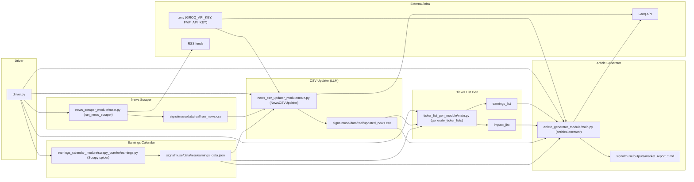

## SignalMuse AI Agent

Minimal, modular pipeline that scrapes earnings and news, classifies/articles, builds ticker lists, and generates a concise market report.

## Requirements
- Python 3.10+ (Windows/macOS/Linux)
- pip
- Scrapy CLI (installed via pip with project requirements)

## Setup
```bash
python -m venv .venv
.\.venv\Scripts\activate  # Windows PowerShell
pip install -r requirements.txt
copy env.template .env  # then edit .env
```
Set environment variables in `.env`:
- GROQ_API_KEY (required)
- FMP_API_KEY (optional)

## Data & Outputs
- Input/working: `signalmuse/data/real/` (e.g., `raw_news.csv`, `earnings_data.json`, `updated_news.csv`)
- Reports: `signalmuse/outputs/` (markdown files)

## Run Full Pipeline (recommended)
```bash
python .\driver.py
```

## Run Steps Individually
1) Earnings calendar (scrapes to `earnings_data.json`)
```bash
scrapy runspider .\signalmuse\earnings_calendar_module\scrapy_crawler\earnings.py
# If Scrapy not on PATH:
python -m scrapy runspider .\signalmuse\earnings_calendar_module\scrapy_crawler\earnings.py
```
2) News scraper (writes `raw_news.csv`)
```bash
python .\signalmuse\news_scraper_module\main.py --max-articles 20
```
3) CSV updater (LLM classify + ticker extraction → `updated_news.csv`)
```bash
python .\signalmuse\news_csv_updater_module\main.py
```
4) Ticker list generator (prints top earnings/impact lists)
```bash
python .\signalmuse\ticker_list_gen_module\main.py
```
5) Article generator (creates report in `signalmuse/outputs/`)
```bash
python .\signalmuse\article_generator_module\main.py
```

## Notes
- Ensure `.env` has `GROQ_API_KEY` before steps 3 and 5.
- Logs print to console. For more detail, run modules and adjust log levels in code if needed.

## Architecture
