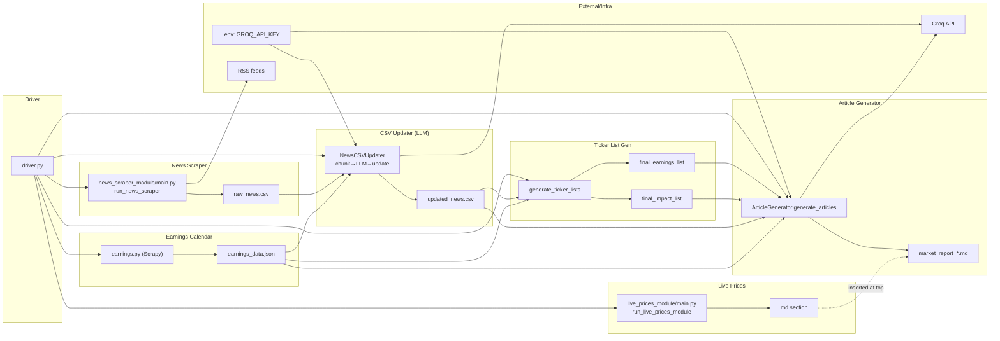

## SignalMuse AI Agent

Enterprise-grade, modular AI pipeline that scrapes market news and earnings, classifies and enriches articles with LLMs, builds prioritized ticker lists, fetches live prices/sentiment, and generates a polished newspaper-style markdown report.

### Key Capabilities
- Live prices and sentiment with `yfinance`
- Earnings calendar scraping via `scrapy`
- Multi-source RSS scraping and normalization
- LLM-based classification and ticker extraction (Groq)
- Deterministic ticker list generation and prioritization
- Structured markdown report generation with sources and compliance

## Quickstart

### Prerequisites
- Python 3.10+
- Windows PowerShell or a Unix shell
- API key: Groq (`GROQ_API_KEY`)

### Installation
```powershell
python -m venv .venv

.\.venv\Scripts\activate

pip install -r requirements.txt

# Required extras not in requirements.txt today:
pip install yfinance scrapy
Copy-Item env.template .env

```

Edit `.env` and set at least:
- `GROQ_API_KEY` (required)
- `FINNHUB_API_KEY` (optional)

### Run the full pipeline
```powershell
python .\driver.py
```

### Run modules individually
- Earnings calendar → writes `signalmuse/data/real/earnings_data.json`:
```powershell
scrapy runspider .\signalmuse\earnings_calendar_module\scrapy_crawler\earnings.py
# or
python -m scrapy runspider .\signalmuse\earnings_calendar_module\scrapy_crawler\earnings.py
```
- News scraper → writes `signalmuse/data/real/raw_news.csv`:
```powershell
python .\signalmuse\news_scraper_module\main.py --max-articles 20
```
- News CSV updater (LLM classify + ticker extraction) → writes `updated_news.csv`:
```powershell
python .\signalmuse\news_csv_updater_module\main.py
```
- Ticker list generator → prints two lists to console and returns from API:
```powershell
python .\signalmuse\ticker_list_gen_module\main.py
```
- Article generator → writes `signalmuse/outputs/market_report_*.md`:
```powershell
python .\signalmuse\article_generator_module\main.py
```
- Live prices generator → writes `signalmuse/outputs/market_report_*.md`:
```powershell
python .\signalmuse\live_prices_module\main.py
```

## Repository Layout
```text
signalmuse/
  live_prices_module/           # Live prices + sentiment → markdown section
  earnings_calendar_module/     # Scrapy spider → earnings_data.json
  news_scraper_module/          # Multi-source RSS → raw_news.csv
  news_csv_updater_module/      # LLM classify/extract → updated_news.csv
  ticker_list_gen_module/       # Build earnings/impact ticker lists
  article_generator_module/     # LLM report builder → market_report_*.md
  data/real/                    # Input/output working data files
  outputs/                      # Generated markdown reports
utils/                          # Logging, config, IO utilities
driver.py                       # Orchestrates the end-to-end pipeline
```

## End-to-End Pipeline Orchestration
The driver runs modules in this order and stitches outputs together:

1) Live prices module
   - `signalmuse.live_prices_module.main.run_live_prices_module()`
   - Returns a fully formatted markdown section (with sentiment signal)

2) Earnings calendar
   - Runs Scrapy spider `earnings_calendar_module/scrapy_crawler/earnings.py`
   - Writes `signalmuse/data/real/earnings_data.json`

3) News scraper
   - `signalmuse.news_scraper_module.main.run_news_scraper()`
   - Writes `signalmuse/data/real/raw_news.csv`

4) News CSV updater
   - `signalmuse.news_csv_updater_module.main.NewsCSVUpdater.process_news_csv()`
   - Chunks CSV in size 10; prompts LLM; updates `label` and `ticker`
   - Filters out label 0 and writes `updated_news.csv`

5) Ticker list generator
   - `signalmuse.ticker_list_gen_module.main.generate_ticker_lists()`
   - Returns `(final_earnings_list, final_impact_list)`

6) Article generator
   - `signalmuse.article_generator_module.main.ArticleGenerator.generate_articles()`
   - Builds report file, appends sections, adds compliance footer
   - Driver inserts live prices section at top via `insert_live_prices_section`

### Driver success criteria
- Each step must succeed before progressing. Any failure stops pipeline early except live-prices insertion (non-fatal).

## Architecture Diagram


## Data Contracts

### raw_news.csv (news_scraper_module)
- Columns: `title, link, summary, published, source, category, priority, guid, author, tags, id`
- `id`: deterministic 5-digit string per article (see `multi_source_scraper._generate_article_id`)

### updated_news.csv (news_csv_updater_module)
- Inherits columns from `raw_news.csv`, plus:
- `label` and `ticker`
- Label mapping used by code:
  - 0 = NONE
  - 1 = EARNINGS
  - 2 = IMPACT
  - 3 = BOTH
- Save behavior: rows with `label == 0` are filtered out when writing `updated_news.csv`.

### earnings_data.json (earnings_calendar_module)
- Array of objects with fields like `company_name, ticker, earnings_date, eps_forecast, eps_actual, surprise, scraped_at, source, source_url`

### Report markdown (article_generator_module)
- Header (UnBound X branding)
- Live prices section (inserted by driver)
- Earnings section (per ticker)
- Market impact section (per ticker)
- Compliance footer

## Module Reference

### Live Prices Module
- File: `signalmuse/live_prices_module/main.py`
- Public API: `run_live_prices_module() -> str`
- Sources tickers via `yfinance` in one batch: ES=F, NQ=F, RTY=F, ^GSPC, ^IXIC, ^RUT, CL=F, ^TNX, ^VIX
- Sentiment rules on average futures change:
  - > 1.0 → Bullish
  - > 0.3 → Cautiously Optimistic
  - > -0.3 → Neutral
  - > -1.0 → Cautiously Pessimistic
  - else → Bearish
- Output: deterministic markdown section for insertion at top of report.

### Earnings Calendar Module
- File: `signalmuse/earnings_calendar_module/scrapy_crawler/earnings.py`
- Command: see Quickstart
- Notes: obeys a polite download delay; may be blocked by Cloudflare. Writes `earnings_data.json`.

### News Scraper Module
- Entrypoint: `signalmuse/news_scraper_module/main.py`
- Core: `scraper/multi_source_scraper.py` with configurable feeds in `scraper/feed_config.py`
- Processing/validation: `pipeline/data_processor.py`
- Output: `raw_news.csv`

### News CSV Updater (LLM)
- Entrypoint class: `NewsCSVUpdater`
- Components:
  - `GroqClientManager` (rate limiting, client setup)
  - `ChunkProcessor` (chunk=10, extract `id,title,summary`, build prompt, parse JSON)
  - `CSVUpdater` (backup, add new columns, integrate responses, filter+save)
- Prompt contract: strict JSON array of `{news_id, label, ticker}`
- Rate limiting: default 5 seconds between calls

### Ticker List Generator
- Entrypoint: `generate_ticker_lists() -> (final_earnings_list, final_impact_list)`
- Logic:
  - Extract unique CSV tickers from `updated_news.csv`
  - Intersect vs earnings tickers from `earnings_data.json`
  - v1 buckets: matches → earnings; non-matches → impact
  - For each bucket, sort corresponding articles by `priority` and select top 5 unique tickers

### Article Generator
- Entrypoint class: `ArticleGenerator`
- Method: `generate_articles(earnings_list: Set[str], impact_list: List[str]) -> str`
- Data loading: reuses `ticker_list_gen_module.data_loader`
- Prompts: `article_generator_module/prompt_templates.py`
- Appending pattern: `report_builder.py` (adds section headers once, appends sources, and a compliance footer)
- Note: current implementation generates one ticker per LLM call for both earnings and impact (batching can be added later).

## Operations Runbook

## Troubleshooting
- Earnings spider blocked: rerun later or switch source. Cloudflare may throttle.
- `raw_news.csv`/`earnings_data.json` not found: run scraper/earnings steps first.
- LLM response parsing errors: module logs the raw snippet; ensure the model returns a pure JSON array.

## Extensibility
- Add RSS sources: edit `news_scraper_module/scraper/feed_config.py`.
- Change label mapping: update `NewsClassificationResponse` and downstream logic in `CSVUpdater.save_updated_csv`.
- Adjust ticker limits: `ticker_list_gen_module/config.py` (`TOP_EARNINGS_TICKERS_LIMIT`, `TOP_IMPACT_TICKERS_LIMIT`).
- Swap models: update model names in `news_csv_updater_module/chunk_processor.py` and `article_generator_module/main.py`.

## API Summary (for integrators)
- Driver: run `python driver.py`; returns exit code 0 on success.
- Live prices: `run_live_prices_module() -> str` (md section)
- Earnings: CLI `scrapy runspider` (writes JSON)
- News scraper: `run_news_scraper(...) -> str | None` (path)
- CSV updater: `NewsCSVUpdater().process_news_csv() -> bool`
- Ticker lists: `generate_ticker_lists() -> (List[str], List[str])`
- Articles: `ArticleGenerator().generate_articles(earnings: Set[str], impact: List[str]) -> str` (path)


## GG