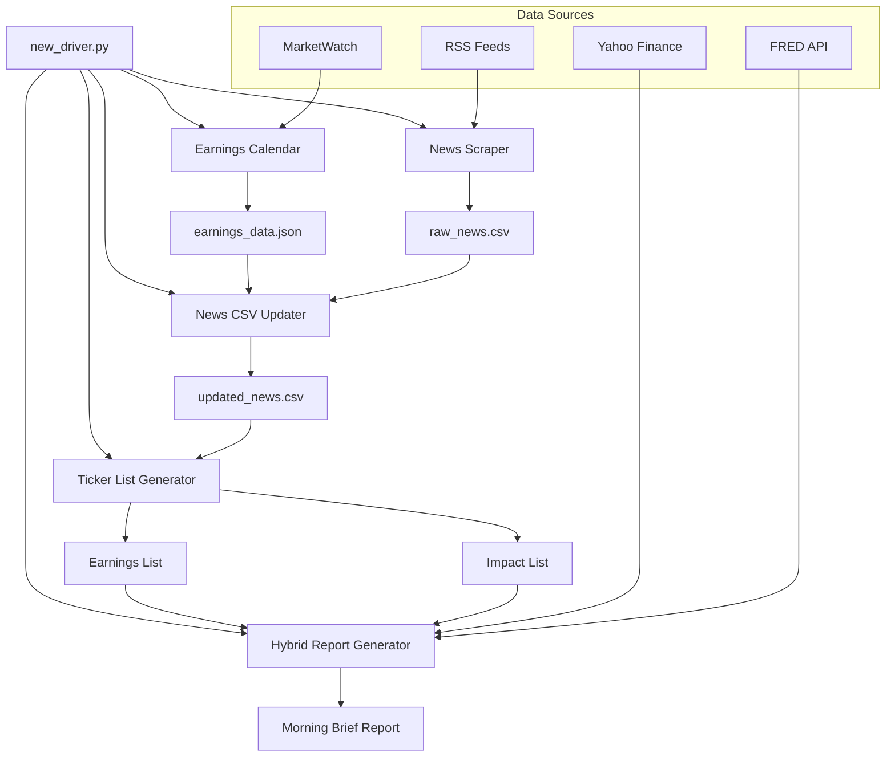

# SignalMuse AI Agent - Hybrid Market Intelligence Pipeline

Enterprise-grade, modular AI pipeline that scrapes market news and earnings, classifies and enriches articles with LLMs, builds prioritized ticker lists, fetches live prices/sentiment, and generates a polished morning brief format report.

## Key Capabilities

- **Complete Pipeline Orchestration**: Automated end-to-end data collection and processing
- **Live Market Data**: Real-time prices, sentiment, and market indicators via `yfinance`
- **Earnings Intelligence**: Automated earnings calendar scraping via `scrapy`
- **Multi-Source News**: RSS scraping and normalization from major financial sources
- **LLM-Powered Analysis**: Groq-based classification, ticker extraction, and content generation
- **Smart Ticker Prioritization**: Deterministic ticker list generation with market impact scoring
- **Morning Brief Format**: Professional, compact one-page market intelligence reports
- **Economic Indicators**: Real-time economic data from FRED API and multiple sources
- **Fed Commentary**: Structured Fed speak tracking and upcoming events


## Architecture Overview

### Pipeline Flow


## Quickstart

### Prerequisites
- Python 3.10+
- Windows PowerShell or Unix shell
- **Required API Key**: Groq (`GROQ_API_KEY`)

### Installation
```powershell
# Create virtual environment
python -m venv .venv

# Activate environment
.\.venv\Scripts\activate

# Install dependencies
pip install -r requirements.txt

# Install additional required packages
pip install yfinance scrapy

# Setup environment
Copy-Item env.template .env
```

### Environment Configuration
Edit `.env` and set:
```bash
GROQ_API_KEY=your_groq_api_key_here  # Required
```

### Run the Complete Pipeline
```powershell
python new_driver.py
```

The pipeline will:
1. Scrape earnings data from MarketWatch
2. Collect news from multiple RSS sources
3. Process and classify news with LLM
4. Generate prioritized ticker lists
5. Create a comprehensive morning brief report

**Output**: `signalmuse/outputs/UnBound_Hybrid_Brief_YYYY-MM-DD_HHMM.md`

## Repository Structure

```
Signal-Muse-AI-Agent/
├── new_driver.py                    # Main pipeline orchestrator
├── test_new_driver.py              # Basic functionality tests
├── test_real_data.py               # Economic data tests
├── requirements.txt                # Python dependencies
├── env.template                    # Environment template
├── readme.md                       # This file
└── signalmuse/
    ├── earnings_calendar_module/   # Scrapy spider for earnings
    ├── news_scraper_module/        # Multi-source RSS scraper
    ├── news_csv_updater_module/    # LLM classification & enrichment
    ├── ticker_list_gen_module/     # Ticker prioritization
    ├── live_prices_module/         # Real-time market data
    ├── morning_brief_module/       # Economic indicators & formatting
    ├── article_generator_module/   # Legacy report generator
    ├── data/real/                  # Working data files
    │   ├── earnings_data.json     # Scraped earnings data
    │   ├── raw_news.csv           # Raw RSS articles
    │   └── updated_news.csv       # LLM-processed articles
    └── outputs/                    # Generated reports
        └── UnBound_Hybrid_Brief_*.md
```

## Module Reference

### 1. Earnings Calendar Module
- **File**: `signalmuse/earnings_calendar_module/scrapy_crawler/earnings.py`
- **Function**: Scrapes earnings data from MarketWatch
- **Output**: `signalmuse/data/real/earnings_data.json`
- **Data Format**: JSON array with company info, EPS data, surprises

### 2. News Scraper Module
- **File**: `signalmuse/news_scraper_module/main.py`
- **Function**: Multi-source RSS scraping and normalization
- **Sources**: Bloomberg, CNBC, MarketWatch, Reuters, Yahoo Finance
- **Output**: `signalmuse/data/real/raw_news.csv`
- **Features**: Deduplication, priority scoring, source tracking

### 3. News CSV Updater Module
- **File**: `signalmuse/news_csv_updater_module/main.py`
- **Function**: LLM-powered article classification and ticker extraction
- **LLM**: Groq API with rate limiting (5-second delays)
- **Processing**: Chunks of 10 articles, JSON response parsing
- **Output**: `signalmuse/data/real/updated_news.csv`
- **Classification**: EARNINGS (1), IMPACT (2), BOTH (3), NONE (0)

### 4. Ticker List Generator Module
- **File**: `signalmuse/ticker_list_gen_module/main.py`
- **Function**: Generates prioritized ticker lists
- **Logic**: 
  - Earnings list: Intersection of news tickers and earnings data
  - Impact list: High-priority news tickers not in earnings
- **Limits**: Top 5 tickers per category
- **Output**: `(earnings_list: Set[str], impact_list: List[str])`

### 5. Live Prices Module
- **File**: `signalmuse/live_prices_module/main.py`
- **Function**: Real-time market data and sentiment analysis
- **Data Sources**: Yahoo Finance (yfinance)
- **Indicators**: S&P 500, Nasdaq, Russell 2000, VIX, Treasury yields, oil
- **Sentiment**: Automated based on futures movement
- **Output**: MarketData object with current levels and sentiment

### 6. Hybrid Report Generator (new_driver.py)
- **Class**: `HybridReportGenerator`
- **Function**: Creates morning brief format reports
- **Features**:
  - Ticker-specific headlines and earnings processing
  - LLM-generated market summaries
  - Economic indicators from multiple sources
  - Fed commentary and upcoming events
  - Compact one-page layout

## 📊 Data Contracts

### earnings_data.json
```json
[
  {
    "company_name": "Apple Inc.",
    "ticker": "AAPL",
    "fiscal_quarter": "06/30/2025",
    "eps_forecast": "1.25",
    "eps_actual": "1.30",
    "surprise": "0.05 (4.00%)",
    "source": "marketwatch",
    "scraped_at": "2025-08-15T14:46:04.647259"
  }
]
```

### raw_news.csv
- **Columns**: `title, link, summary, published, source, category, priority, guid, author, tags, id`
- **id**: Deterministic 5-digit string per article
- **priority**: Source-based priority scoring

### updated_news.csv
- **Inherits**: All columns from `raw_news.csv`
- **Added**: `label, ticker`
- **Label Mapping**:
  - 0 = NONE (filtered out)
  - 1 = EARNINGS
  - 2 = IMPACT  
  - 3 = BOTH

## 🎯 Morning Brief Report Format


###### [**CLICK HERE to view Latest Morning Brief Report**](signalmuse/outputs/UnBound_Hybrid_Brief_2025-08-15_1513.md)

### Market Outlook Section
- LLM-generated 2-3 sentence market summary
- Current market sentiment and key drivers

### Key Metrics Table
- S&P 500, Dow Jones, Nasdaq levels and changes
- VIX (Fear Index) and Treasury yields
- Real-time data from Yahoo Finance

### Economic Data Table
- Non-Farm Payrolls, Unemployment Rate
- Inflation (CPI), PMI Manufacturing, PMI Services
- Real data from FRED API with fallbacks

### Fed Commentary
- Recent quotes from Fed officials
- Upcoming speeches and events
- Structured bullet-point format

### Top Headlines
- Market-moving headlines for impact tickers
- Scoring based on earnings, Fed, deals, major companies
- Source attribution and impact scores

### Earnings Update
- Ticker-specific earnings summaries
- LLM-generated 2-line analysis per company
- EPS data with surprises and forecasts

## 🔧 Configuration

### Environment Variables
```bash
GROQ_API_KEY=your_api_key_here  # Required for LLM processing
```

### Ticker Limits
- **Earnings tickers**: Top 5 from earnings data intersection
- **Impact tickers**: Top 5 from high-priority news
- **Configurable**: In `ticker_list_gen_module/config.py`

## 🔄 Extensibility

### Adding News Sources
Edit `signalmuse/news_scraper_module/scraper/feed_config.py`:
```python
RSS_FEEDS = [
    RSSFeed(
        id="new_source",
        name="New Source",
        url="https://new-source.com/rss",
        category="finance",
        priority=5
    )
]
```

### Modifying Economic Indicators
Update `_get_economic_indicators()` in `new_driver.py`:
```python
indicator_order = [
    ('new_indicator', 'New Indicator'),
    # ... existing indicators
]
```

### Changing LLM Models
Update model names in relevant modules:
```python
model="llama-3.1-8b-instant"  # Current model
```

### Adjusting Ticker Limits
Edit `signalmuse/ticker_list_gen_module/config.py`:
```python
TOP_EARNINGS_TICKERS_LIMIT = 10  # Increase from 5
TOP_IMPACT_TICKERS_LIMIT = 10    # Increase from 5
```

## 📈 Performance

### Execution Time
- **Full pipeline**: ~ Under 5 minutes (including rate limiting)
- **News processing**: ~2-3 minutes (LLM calls)
- **Report generation**: Sub 1 minute

### Data Freshness
- **Market data**: Real-time (1-minute delay)
- **News**: RSS feed dependent (5-15 minute delay)
- **Earnings**: Daily scraping from MarketWatch
- **Economic indicators**: Monthly updates from FRED

## Development Setup

```powershell
# Clone repository
git clone <repository-url>
cd Signal-Muse-AI-Agent

# Setup development environment
python -m venv .venv
.\.venv\Scripts\activate
pip install -r requirements.txt
pip install yfinance scrapy

# Run tests
python test_new_driver.py
python test_real_data.py
```
## 📄 License

This project is for educational use only. Please ensure compliance with:
- RSS feed terms of service
- API usage agreements
- Data source licensing requirements

---

**SignalMuse AI Agent** - Professional market intelligence powered by AI